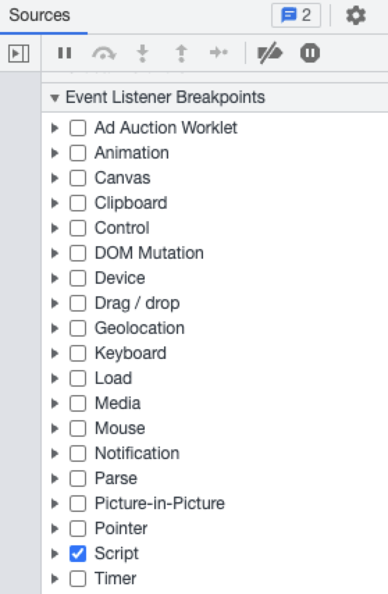
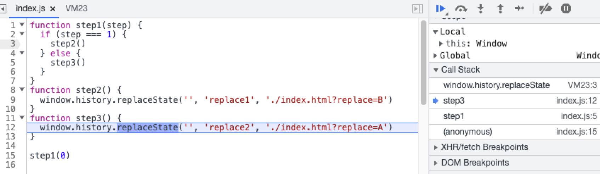

# 页面跳转

## 问题现象
打开页面后立即跳转到新地址

## 定位步骤
1. 新打开 Chrome 标签并打开开发者工具 DevTools

2. 切换到 Sources 面板并在右侧调试面板中的 "Event Listener Breakpoints" 中勾选 "Script"



3. 输入页面地址，页面将在所有代码执行前进入断点

4. 在控制台中输入以下代码并执行

  ```javascript
  var _replace = window.history.replaceState
  window.history.replaceState = function() {
    debugger
    return _replace.apply(this, arguments)
  }
  ```
  
5. 点击 "Resume script execution" 按钮，执行到上述代码的 debugger 处

6. 查看 "Call Stack" 分析程序调度来源

  