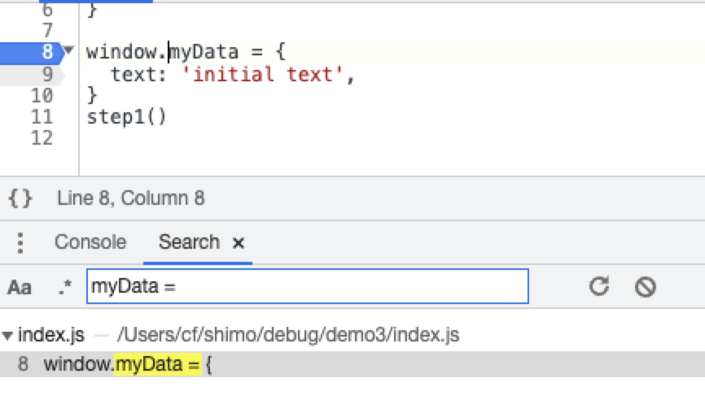
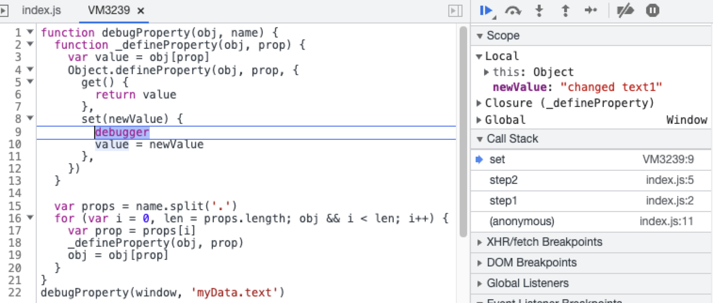

# 数据变更

## 问题现象
数据 "myData" 中的 "text" 属性值被未预期的更改

## 定位步骤
1. 进入页面并打开开发者工具 DevTools

2. 打开 "Search" 面板 ( ⌘ + ⌥ + S) 并搜索 "myData =" 在数据初始化处打断点 



3. 刷新页面并进度数据初始化处断点，并点击 "Step over next function call" 执行完初始化

4. 在控制台中输入以下代码并执行

```javascript
function debugProperty(obj, name) {
  function _defineProperty(obj, prop) {
    var value = obj[prop]
    Object.defineProperty(obj, prop, {
      get() {
        return value
      },
      set(newValue) {
        debugger
        value = newValue
      },
    })
  }
  
  var props = name.split('.')
  for (var i = 0, len = props.length; obj && i < len; i++) {
    var prop = props[i]
    _defineProperty(obj, prop)
    obj = obj[prop]
  }
}
debugProperty(window, 'myData.text')
```

5. 点击 "Resume script execution" 按钮，执行到上述代码的 debugger 处
6. 查看 "Call Stack" 分析程序调度来源

  


